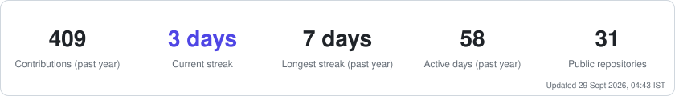
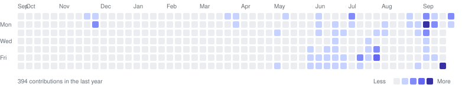

### Full-Stack Developer · 3rd-year CSE @ VIT Bhopal · Intern @ Labmentix

---

## 👋 About

I'm a 3rd-year Computer Science student at **VIT Bhopal** who builds full-stack products end to end — schema, API, UI and deploy — across **TypeScript/Node** and **Java/Spring Boot**.

- 💼 **Full-stack web development intern at Labmentix** (Jun 2026 – present) — shipped SmartERP, PDF Sign, CloudVault and Voxora
- 🧭 Also built **TripSync**, an AI trip planner that respects opening hours, meal times and budget
- 🌱 Going deeper on **system design**, **Postgres** and **DSA**
- 💡 I like problems where the hard part is the data model, not the CSS
- 📫 **ritikagarwal2468@gmail.com** · [ritikagarwal.me](https://www.ritikagarwal.me)

---

## 🛠 Tech Stack

**Languages**

**Frontend**

**Backend & Data**

**Tools & Deploy**

---

## 🚀 Featured Projects

<table>
<tr>
<td width="50%" valign="top">

### 📊 SmartERP
**Billing, inventory & accounting** · *Labmentix*

Tally-inspired, keyboard-first, multi-tenant ERP: company-scoped data isolation, double-entry validation inside database transactions, GST invoices with PDF export.

`Next.js 14` `Express` `Prisma` `PostgreSQL`

[**→ Source**](https://github.com/Ritik0712-ai/SmartERP)

</td>
<td width="50%" valign="top">

### 📄 PDF Sign
**Document e-signature platform** · *Labmentix*

Drag-and-drop signature placement, per-signer signing links secured by random 256-bit tokens, signed-PDF generation, email notifications and an audit trail.

`React` `Vite` `Express` `pdf-lib` `Supabase`

[**→ Source**](https://github.com/Ritik0712-ai/pdf-sign-app)

</td>
</tr>
<tr>
<td width="50%" valign="top">

### ☁️ CloudVault
**Cloud file storage & sharing** · *Labmentix*

Direct-to-storage uploads via signed URLs, nested folders, viewer/editor sharing, password-protected expiring public links, trash and search.

`Java 17` `Spring Boot` `React` `PostgreSQL`

[**→ Source**](https://github.com/Ritik0712-ai/storeit)

</td>
<td width="50%" valign="top">

### 🔊 Voxora
**Multilingual text-to-speech** · *Labmentix*

Translates before it speaks — type English, hear fluent Bengali, Hindi or Tamil. 30 neural voices across 15 languages, on a zero-cost stack.

`React` `Vite` `Node.js` `PostgreSQL` `Cloudflare R2`

[**→ Live**](https://voxora-tau.vercel.app) · [**Source**](https://github.com/Ritik0712-ai/Voxora)

</td>
</tr>
<tr>
<td width="50%" valign="top">

### 🧭 TripSync
**AI trip planner with real-world constraints**

Itineraries that respect opening hours, meal times, travel time and budget; Groq → Gemini provider chain; owner/editor/viewer sharing.

`Next.js` `TypeScript` `Neon Postgres` `Drizzle`

[**→ Live**](https://tripsync-hazel.vercel.app) · [**Source**](https://github.com/Ritik0712-ai/TripSync)

</td>
<td width="50%" valign="top">

### 🤖 Codexa
**AI-powered code review assistant**

Instant, actionable feedback on your code — catches bugs, smells and security issues before review does.

`Next.js` `TypeScript` `Express` `Prisma` `OpenAI`

[**→ Source**](https://github.com/Ritik0712-ai/Codexa)

</td>
</tr>
</table>

**Also:** [SmartInsurance](https://github.com/Ritik0712-ai/SmartInsurance) — insurance lifecycle SaaS · [MindSpace](https://github.com/Ritik0712-ai/mindspace-app) — anonymous mental-wellness platform · [Project Context Tracker](https://github.com/Ritik0712-ai/project-context-tracker) — VS Code extension that keeps a `CONTEXT.md` for AI assistants · [E-Cell Ticket System](https://ecell-ticket-system.vercel.app)

---

## 📈 GitHub Activity

<picture>
  <source media="(prefers-color-scheme: dark)" srcset="assets/stats-dark.svg" />
  
</picture>

<picture>
  <source media="(prefers-color-scheme: dark)" srcset="assets/calendar-dark.svg" />
  
</picture>

**Recently active**

<!-- RECENT:START -->
| Repository | About | Language | Last push |
|---|---|---|---|
| [**Safar**](https://github.com/Ritik0712-ai/Safar) | Safar is an India-focused cab booking web app built with Next.js, Firebase, Leaflet, Geoapify, and Razorpay, featuring passenger and driver dashboards, live ride tracking, sandbox payments, receipts, and an admin workspace. | TypeScript | yesterday |
| [**koshvista**](https://github.com/Ritik0712-ai/koshvista) | — | TypeScript | 4 days ago |
| [**suraksha_setu**](https://github.com/Ritik0712-ai/suraksha_setu) | — | JavaScript | 5 days ago |
| [**koshvista-android**](https://github.com/Ritik0712-ai/koshvista-android) | Open-source Android app for tracking expenses, cash, investments, FDs, and net worth. | Kotlin | 8 days ago |
| [**portfolio-26**](https://github.com/Ritik0712-ai/portfolio-26) | — | TypeScript | 11 days ago |
<!-- RECENT:END -->

Stats, calendar and this list are regenerated every 6 hours from the GitHub API by <a href=".github/workflows/profile.yml">a workflow in this repo</a>.

---

**Open to internships and collaboration on full-stack projects.**

